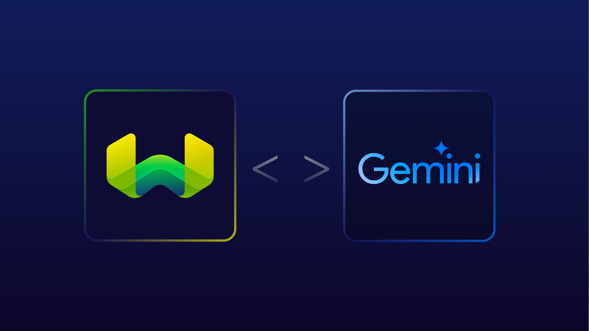

# Weaviate Vector Database with Google Gemini Ultra Quickstart Guide

This repository contains a Jupyter Notebook that sets you up to use the Weaviate vector database with Google Gemini Ultra.



## Prerequisites

- Python 3.6 or higher
- Weaviate Python client (V4)
- Google Gemini Ultra Access
- Weaviate running 1.24 with the Generative Palm 

## Setup

1. Clone this repository to your local machine.
2. Install the necessary Python packages using pip:
    ```bash
        $ python3 -m venv venv
        $ source venv/bin/activate
        $ pip install -r requirements.txt
        $ jupyter notebook
    ```
3. Get an API Key from [Google Maker Suite](https://makersuite.google.com) to make calls against Gemini Ultra. 
4. Copy env.sample to .env and replace the API key and associate GCP project id into the .env file

## Usage

Run the `jupyter notebook`, then open the notebok in a browser to interact with the Weaviate vector database using Google Gemini Ultra. Execute through each cell to try out a semantic search and a generative search or RAG example which leverages Google Gemini Ultra as the model.